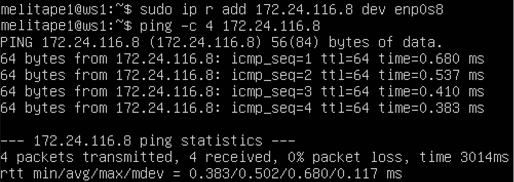
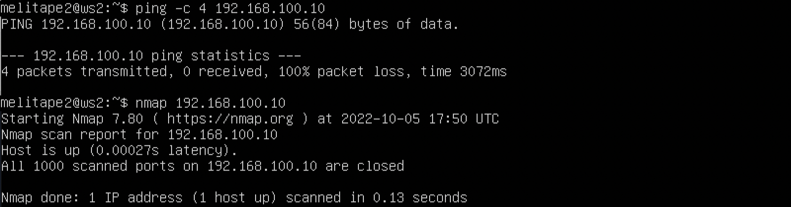

## Part 1. Инструмент ipcalc
### 1.1. Сети и маски
* Устанавливаем инструмент ipcalc командой `sudo apt install ipcalc` 
* Для определения адреса сети используем команду `ipcalc 192.167.38.54/13`, рассчитанный адрес смотрим в строке `Network`  
 *Адрес сети 192.167.38.54/13* 

* Переводим маску 255.255.255.0 в префиксную и двоичную запись `ipcalc 255.255.255.0`, результат смотрим в строке `Network` (перфиксная - 24, двоичная - 11111111.11111111.11111111.00000000) 
 *255.255.255.0 в префиксную и двоичную запись* 
* Переводим маску /15 в обычную и двоичную `ipcalc /15`, результат смотрим в строке `Network` 
 */15 в обычную и двоичную* 
* ipcalc не переводит маску из двоичной системы. Для расчета префикса посичтаем количество используемых бит - 11111111.11111111.11111111.11110000 занято 28 бит, значит перфикс равен /28 `ipcalc /28` обычная запись маски в строке `Address` 
 */28 в обычную* 

* Минимальный и максимальный хост в сети отображаются в строках `HostMin` и `HostMax` соответсвенно. Определяем минимальный и максимальный хост в сети 12.167.38.4 при маске /8 `ipcalc 12.167.38.4/8` 
 *MinMaxHost при маске /8* 
* при маске 11111111.11111111.00000000.00000000 `ipcalc 12.167.38.4/16` 
 *MinMaxHost при маске 11111111.11111111.00000000.00000000* 
* при маске 255.255.254.0 `ipcalc 12.167.38.4 255.255.254.0` 
 *MinMaxHost при маске 255.255.254.0* 
* при маске /4 `ipcalc 12.167.38.4/4` 
 *MinMaxHost при маске /4* 

### 1.2. localhost
* **localhost** -в компьютерных сетях, стандартное, официально зарезервированное доменное имя для частных IP-адресов (в диапазоне 127.0.0.1 — 127.255.255.254) 
* Исходя из этого можно обратиться к приложению с IP: `127.0.0.2` и `127.1.0.1` 
* Нельзя обратиться к приложению с IP: `194.34.23.100` и `128.0.0.1` 

### 1.3. Диапазоны и сегменты сетей
* Частными IP-адресами являюся: 
10.0.0.45 
192.168.4.2 
172.20.250.4 
172.16.255.255 
10.10.10.10 
* Публичными IP-адресами являюся: 
134.43.0.2 
172.0.2.1 
192.172.0.1 
172.68.0.2 
192.169.168.1 

* Для определения какие из перечисленных IP адресов шлюза возможны у сети 10.10.0.0/18 используем команду `ipcalc 10.10.0.0/18`, после чего определим какие из перечисленных адресов попадают в диапозон HostMin - HostMax 
 *Вывод команды ipcalc 10.10.0.0/18* 
* Возможные адреса: 
10.10.0.2 
10.10.10.10 
10.10.1.255 

## Part 2. Статическая маршрутизация между двумя машинами
* С помощью команды `ip a` проверим существующие сетевые интерфейсы. 
 *Cетевые интерфейсы ws1* 
 *Cетевые интерфейсы ws2* 

* Для того, чтобы описать сетевой интерфейс, выполняем команду `sudo vim /etc/netplan/00-installer-config.yaml` на каждой машине. После чего задаем необходимые адреса. 
 *Измененные сетевые интерфейсы ws1* 
 *Измененные сетевые интерфейсы ws2* 
* Выполняем команду `netplan apply` для перезапуска сервиса сети 
 *netplan apply ws1* 
 *netplan apply ws1* 

### 2.1. Добавление статического маршрута вручную
* Добавляем статический маршрут от одной машины до другой и обратно при помощи команды `ip r add`, после чего пингуем соединение 
 *ping ws1* 
 *ping ws2* 

### 2.2. Добавление статического маршрута с сохранением
* Перезапускаем машины командой `sudo reboot` 
* Открываем с помощъю тектового редактора файл `/etc/netplan/00-installer-config.yaml` на каждой машине и добавляе статический маршрут 
 *Статический маршрут ws1* 
 *Статический маршрут ws2* 
* Пингуем соединение на обеих машинах 
 *Ping ws1* 
 *Ping ws2* 

## Part 3. Утилита iperf3

### 3.1. Скорость соединения
* 8 Mbps = 1 MB/s 
* 100 MB/s = 819200 Kbps, 
* 1 Gbps = 1024 Mbps 

### 3.2. Утилита iperf3
* Устанавливаем утилиту на обеих машинах командой `sudo apt install iperf3` 
* Одну из машин устанавливаем как сервер при помощи команды `iperf3 -s`, на второй используем команду `iperf3 -c 192.168.100.10 -p 5201` для измерения скорости соединения 
 *Скорость соединения ws1* 
 *Скорость соединения ws2* 

## Part 4. Сетевой экран

### 4.1. Утилита iptables
* Создаем файл /etc/firewall.sh, имитирующий фаерволл, на ws1 и ws2 и добавить необходимые правила 
 *firewall.sh ws1* 
 *firewall.sh ws2* 
* Запускаем файлы на обоих машинах командой sudo chmod `+x /etc/firewall.sh && sudo sh /etc/firewall.sh` 
 *Запуск файлаws1* 
 *Запуск файла ws2* 
* Разница между стратегиями в том, что они выполняться сверху-вниз, то есть если правило запрета находиться выше - оно срабатывает, а правило разрешения находящиеся ниже - нет. 

### 4.2. Утилита nmap
* Командой `ping` находим машину, которая не "пингуется", после чего утилитой `nmap` показываем, что хост машины запущен 
 *ping и nmap ws2* 
* Сохраняем дампы образов обеих машин 

## Part 5. Статическая маршрутизация сети
* Понимем пять виртуальных машин (3 рабочие станции (ws11, ws21, ws22) и 2 роутера (r1, r2)) 

### 5.1. Настройка адресов машин
* Настраиваем конфигурации машин в etc/netplan/00-installer-config.yaml согласно сети на рисунке 
 *Конфигурация сети ws11* 
 *Конфигурация сети ws21* 
 *Конфигурация сети ws22* 
 *Конфигурация сети r1* 
 *Конфигурация сети r2* 
* Перезапускаем сервис сети, затем командой `ip -4 a` проверяем, что адрес машины задан верно 
 *Адрес сети ws11* 
 *Адрес сети ws21* 
 *Адрес сети ws22* 
 *Адрес сети r1* 
 *Адрес сети r2* 
* Пингуем ws22 c ws21 в обе стороны 
 *Ping ws22 на ws21* 
 *Ping ws21 на ws22* 
* Аналогично пингуем r1 с ws11 в обе стороны 
 *Ping r1 на ws11* 
 *Ping ws11 на r1* 

### 5.2. Включение переадресации IP-адресов
* Для включения переадресации IP, выполняем команду `sysctl -w net.ipv4.ip_forward=1` на роутерах 
* При таком подходе переадресация не будет работать после перезагрузки системы 
 *Вызов команды на r1* 
 *Вызов команды на r2* 

* Откроем файл /etc/sysctl.conf и добавим в него следующую строку `net.ipv4.ip_forward = 1` 
* При использовании этого подхода, IP-переадресация включена на постоянной основе 
 *Измененный sysctl.conf на r1* 
 *Измененный sysctl.conf на r2* 

### 5.3. Установка маршрута по-умолчанию
* Настраиваем маршрут по умолчанию (шлюз) для рабочих станций 
 *Измененный файл на ws11* 
 *Измененный файл на ws21* 
 *Измененный файл на ws22* 
* Вызываем `ip r`, чтобы показать, добавленный маршрут в таблицу маршрутизации 
 *Маршрут на ws11* 
 *Маршрут на ws21* 
 *Маршрут на ws22* 
* Пингуем ws11 с r2 и проверяем на r2, что пинг доходит. Для этого используем команду `sudo tcpdump -tn -i enp0s3` 
 *Ping с ws11 на r2* 
 *Ping доходит до r2* 

### 5.4. Добавление статических маршрутов
* Добавляем в роутеры r1 и r2 статические маршруты в файле конфигураций 
 *Файл конфигураций r1* 
 *Файл конфигураций r2* 
* Вызываем `ip r` для проверки таблицы с маршрутами на обоих роутерах 
 *ip r на r1* 
 *ip r на r2* 
* Запускаем команды `ip r list 10.10.0.0/18` и `ip r list 0.0.0.0/0` на ws1 
 *Команды ip r на ws11* 
* Первый IP-адрес и маска соответствуют маршруту, установленному в сетевом плане (10.10.0.0 /18), а другой нет (одна из вещей, которая не подходит под правило - 0.0.0.0/0 находится вне установленной маски), поэтому он следует маршруту, установленному по умолчанию 

### 5.5. Составление списка маршрутизаторов
* Запускаем на r1 команду дампа `tcpdump -tnv -i enp0s3` 
* При помощи утилиты traceroute строим список маршрутизаторов на пути от ws11 до ws21 командой `traceroute 10.20.0.10 -n` 
 *traceroute на ws11* 
 *tcpdump на r1* 
* Принцип работы traceroute: 
* Для определения промежуточных маршрутизаторов traceroute отправляет серии пакетов данных целевому узлу, при этом каждый раз увеличивая на 1 значение поля TTL («время жизни»). Это обычно приводит к большому количеству маршрутизаторов, которые могут быть пройдены пакетом. Первый пакет отправлен с TTL, высокой скоростью 1, поэтому первый же ответ возвращает сообщение ICMP, указывающее на невозможность доставки данных. Traceroute фиксирует адрес маршрутизатора, а также время между отправкой пакета и получением ответа (эти сведения вы используете на мониторе компьютера). Затем traceroute повторяет отправку пакета, но уже с TTL, размером 2, что позволяет первому маршрутизатору пропустить пакет дальше. 
* Процесс повторяется до тех пор, пока при недостаточном значении TTL пакет не поглощается целевым пакетом. При получении ответа от этого пакета процесс трассировки завершен. 

### 5.6. Использование протокола ICMP при маршрутизацииов
* Запускаем на r1 перехват сетевого трафика, проходящего через eth0 с помощью команды `tcpdump -n -i eth0 icmp` 
* Пингуем с ws11 несуществующий IP с помощью команды `ping -c 1 10.30.0.111` 
 *Ping на ws11* 
 *tcpdump на r1* 
* Делаем дамп для каждой машины

## Part 6. Динамическая настройка IP с помощью DHCP
* Для r2 настраиваем в файле `/etc/dhcp/dhcpd.conf` конфигурацию службы DHCP 
 *dhcpd.conf на r2* 
* В файле resolv.conf прописываем `nameserver 8.8.8.8` 
 *resolv.conf на r2* 
* Перезагружаем службу DHCP командой `systemctl restart isc-dhcp-server` 
 *Перезагрузка DHCP на r2* 
* Перезагружаем машину ws21 при помощи `reboot` и через `ip a` проверяем,  что она получила адрес 
 *Адрес на ws21* 
* Пингуем ws22 с ws21 
 *Ping на ws21* 
* Указываем MAC адрес у ws11, для этого в etc/netplan/00-installer-config.yaml надо добавить строки: `macaddress: 10:10:10:10:10:BA`, `dhcp4: true` 
 *Добавлен MAC адрес на ws11* 
* Для r1 настраиваем аналогично r2, но делаем выдачу адресов с жесткой привязкой к MAC-адресу (ws11). Так-же делаем аналогичные тесты 
 *dhcpd.conf на r1* 
 *resolv.conf на r1 и перезагрузка DHCP* 
 *Адрес на ws11* 
 *Ping на ws11* 
* Вызываем `ip a` на ws21, затем запрашиваем обновление ip и снова вызываем `ip a` 
 *Обновление ip на ws21* 
* dhcilent использует протокол динамической конфигурации хоста для динамической настройки сетевых параметров сетевого интерфейса 
* Имя сетевого интерфейса, который dhclient должен попытаться настроить, можно указать в командной строке. Если имя интерфейса не указано в командной строке, dhclient обычно идентифицирует все сетевые интерфейсы, если возможно, удаляет нешироковещательные интерфейсы и пытается настроить каждый интерфейс 

## Part 7. NAT
* Устанавливаем Apache2 командой `sudo apt-install apache2` 
* В файле `/etc/apache2/ports.conf` на ws22 и r1 изменяем строку Listen 80 на Listen 0.0.0.0:80, то есть делаем сервер Apache2 общедоступным 
 *Измененный ports.conf* 
* Запускаем веб-сервер Apache командой `service apache2 start` на ws22 и r1 
 *Запуск Apache на ws22* 
 *Запуск Apache на r1* 
* Добавляем в фаервол, созданный по аналогии с фаерволом из Части 4, на r2 следующие правила: 
* 1) Удаление правил в таблице filter - iptables -F 
* 2) Удаление правил в таблице "NAT" - iptables -F -t nat 
* 3) Отбрасывать все маршрутизируемые пакеты - iptables --policy FORWARD DROP 
 *firewall.sh на r2* 
* Запускать файл также, как в Части 4 
 *Запуск firewall.sh на r2* 
*  Проверям соединение между ws22 и r1 командой `ping`. При запуске файла с этими правилами, ws22 не должна "пинговаться" с r1 
 *Ping с r1* 
 *Ping с ws22* 
* Разрешаем маршрутизацию всех пакетов протокола ICMP 
 *firewall.sh* 
* Проверяем соединение между ws22 и r1 командой `ping`. При запуске файла с этими правилами, ws22 должна "пинговаться" с r1 
 *Ping с ws22* 
 *Ping с r1* 
* Добавляем в файл ещё два правила: 
5) Включить SNAT, а именно маскирование всех локальных ip из локальной сети, находящейся за r2 (по обозначениям из Части 5 - сеть 10.20.0.0) 
6) Включить DNAT на 8080 порт машины r2 и добавить к веб-серверу Apache, запущенному на ws22, доступ извне сети 
 *firewall.sh* 
* Проверяем соединение по TCP для SNAT, для этого с ws22 подключаемся к серверу Apache на r1 командой: `telnet [адрес] [порт]` 
 *telnet на ws22* 
* Проверием соединение по TCP для DNAT, для этого с r1 подключаемся к серверу Apache на ws22 командой `telnet` 
 *telnet на r1* 

## Part 8. Дополнительно. Знакомство с SSH Tunnels
* Запустить на r2 фаервол с правилами из Части 7 
* Запуск веб-сервера Apache на ws 22 только на localhost 
 *веб-сервер* 
* Воспользоватся Local TCP forwarding с ws21 до ws22, чтобы получить доступ к веб-серверу на ws22 с ws21
 
 *Local TCP* 
* Воспользуемся Remote TCP forwarding c ws11 до ws22, чтобы получить доступ к веб-серверу на ws22 с ws11 
* Запустим с ws11 ssh -R remote_port:local_ip:local_port user@hostname 
 *Remote TCP* 
* Проверим сработало ли подключение 
 
 *Telnet* 
